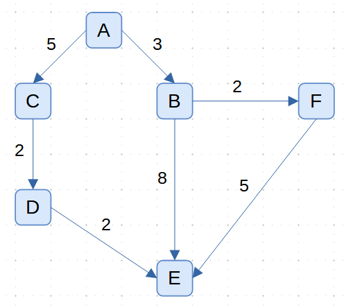

# Dijkstra's Algorithm

[Dijkstra's algorithm](https://en.wikipedia.org/wiki/Dijkstra%27s_algorithm) implementations in Python, with unit testing available via `pytest`.

Edge Cases:
- Negative edge weights
- Cyclical graphs

Because of above, Dijkstra's algorithm only works on *directed acyclic graphs* (one direction, no cycles) whose edges have non-negative weights.

## Method 1

*Note:* `running_cost` indicates the lowest cost from source to the node *so far*.

Big Picture:
1. Store a `cost_table` of `{node: (parent_node, running_cost)}` data for all nodes visited.
2. Store a `closest_costs` `min heap` for every node visited in the graph. The heap stores pairs of `(running_cost, node)` data, keeping the lowest cost pair at the front (top).
3. Start with `source` inserted in `cost_table` and `closest_costs`.
4. Until `closest_costs` min heap is empty, perform steps `5 and 6`.
5. `heappop` the lowest cost pair from `closest_costs`.
6. Find the `edge`s for that pair and:
    - add them to the `cost_table` *only* if the `running_cost` is lower
    - `heappush` the `(running_cost, edge)` pair to `closest_costs`
7. Construct the path by backtracking from `target` to `source` via the `cost_table`.
8. Reverse the path so that it's in `source -> target` order

## Example

The following graph is used in testing:

While there are multiple paths from `A` to `E`, the shortest path is from `A -> C -> D -> E` with a cost of `9`.  Dijkstra's algorithm allows us to find these paths where algorithms like Breadth First Search would fail.

## Testing

Ensure that `pytest` is installed, then run one of the following:
- `pytest dijkstras_algorithm_1.py`
